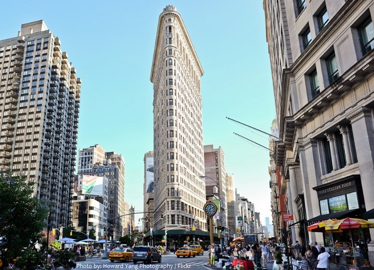

This past summer I worked at [Yext](https://www.yext.com) in New York City. Our office is located at the corner of 23rd and Madison Avenue, right next to the famous Flatiron Building, pictured below.

Living in New York was the best experience in my life, and I want to share some tips on how to have both a productive and fun summer in New York; I hope future interns can make use of this guide.

## If You Work in Manhattan, Live in Manhattan

I made the mistake of living in Brooklyn, which made my 8-stop commute on the F train quite long. My roommate and I grabbed an Airbnb for a much cheaper price, but we still regret not living in the city. Most students live in admittedly-small dorms, but the location is _all_ that matters. After a night out, taking the train home at 3am is the least appealing thing in the world, and Ubers can often break the bank. Just live in Manhattan.

## Make Plans Every Night

An actual conversation I had with my mentor this summer:

> Dylan, do you have plans tonight?
>
> No, not tonight.
>
> Why not? It's New York!

After that, I made a conscious effort to __always__ find an event to go to or make plans to go to dinner with someone after work. Luckily, a fellow intern at my company compiled a calendar of free events in New York over the summer, so I just added that to my Google Calendar. If I'm only going to spend 3 months in the greatest city on Earth, I might as well make the most of it. You should too. 

## Use Pigeon for the Subway

[Pigeon](https://pigeon.area120.com/home) is a crowdsourced transit app for the subway in New York City. Not only can you plan trips and see which lines stop where, but you can also see reports of lines/stations that have problems. On July 13th, the power went out in some of Manhattan, and a lot of lines stopped running. My sister (who was visiting) and I waited in the station for twenty minutes before I finally checked Pigeon and realized what had happened. Without the app, we probably would have waited longer.

Also, be a good samaritan and post on the app! If something is going on, let people know. Good Karma pays off!

## Wait for the Train Outside the Station

No joke, it's 10-15 degrees Fahrenheit hotter in the station. The trains feel great, but the stations feel like standing in the middle of the Sahara Desert wearing a suit made out of tin foil. Get on your phone, check the arrival time on the app, and wait outside until the train is three or so minutes away. 

## Use Yelp to Find Restaurants

Since there are so many restaurants in Manhattan, deciding what to eat feels impossible sometimes. However, whenever going out with friends, we always used [Yelp](https://www.yelp.com) to decide what to eat. It never failed once. 

Pro tip: since you're only there for a short time, use the 4-star or higher filter.

I hope everyone gets the opportunity to spend a summer in New York. It really goes by quickly, so it's important to pack as much as possible into the short time frame. Have fun in the greatest city on Earth!